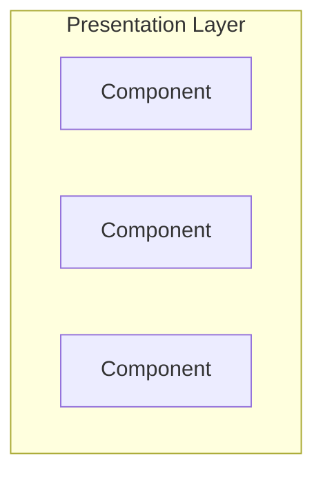
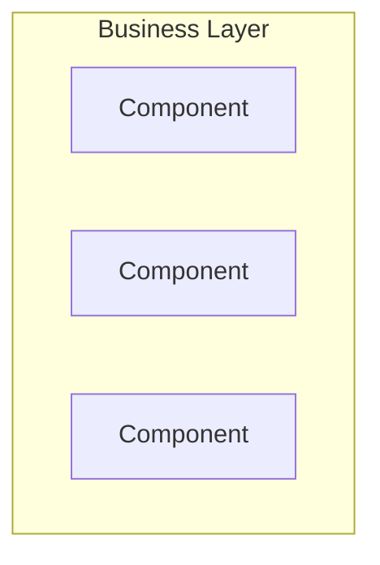
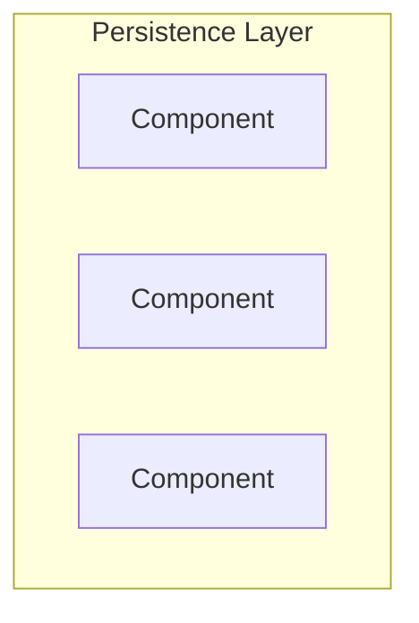
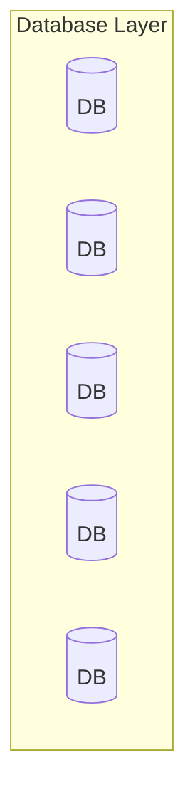

---
title: Layered Architecture
date: 2023-01-23 12:50:00 +09:00
categories: [Blog, Architecture, DDD]
tags: [architecture java ddd]
---

# Layered Architecture?
  
- 구성되는 계층의 숫자에 따라 N-계층 아키텍처라고도 함 (`N-tier Architecture`)
- 각 계층별 역할과 관심사로 구분
- `Layered Architecture`의 가장 강력한 기능은 `관심사 분리(Separation of Concern)`
- 높은 유지보수성과 쉬운 테스트는 장점
  

## 4-Tier Architecture
 

### Presentation Layer
- 화면에 데이터를 표시하거나 서버로 데이터를 전달

### Business Layer
- 비즈니스 로직 수행

### Persistence Layer
- 영속성 구현을 위한 계층

### Database Layer
- 데이터베이스가 위치한 계층

## Layers of Isolation
- 각각의 나눠진 수평 계층은 수직적으로 배치
- 특정 레이어는 바로 하위 레이어에만 연결
- 