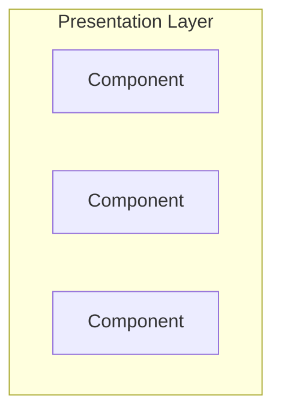
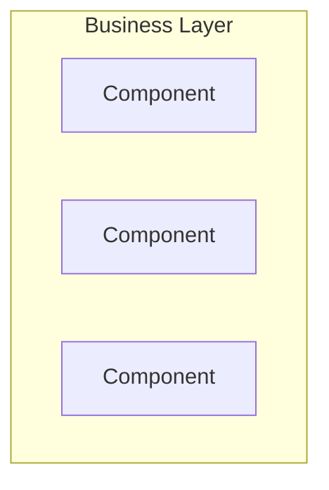
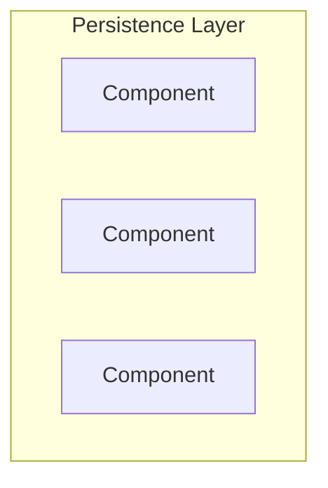
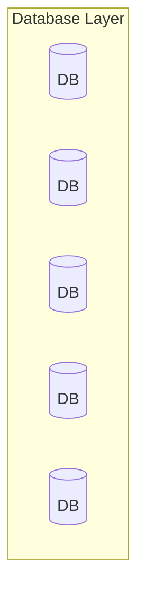

---
title: Layered Architecture
date: 2023-01-23 12:50:00 +09:00
categories: [Blog, Architecture, DDD]
tags: [architecture java ddd]
---

# Layered Architecture?
  
- `관심사 분리(Separation of Concern)`에 따라 시스템을 유사한 관심사로 레이어를 분해하고 각각의 레이어가 하위 레이어에만 의존하도록 구성하는 아키텍처
- `Layer Architecture`의 목적은 각 레이어들이 특정 관심사에 관련된 항목만 포함하도록 만들어 시스템의 결합도를 낮추고 재사용성, 유지보수성을 향상시키는 것
- `DDD(Domain Driven Design)`에서는 주로 아래의 4가지로 분류
	- `Presentation Layer`
	- `Application Layer`
	- `Domain Layer`
	- `Infrastructure Layer`
- 높은 유지보수성과 쉬운 테스트는 장점

#### Presentation Layer
- HTTP 요청과 같은 사용자 요청을 처리하는 `View`나 `Controller`가 여기에 해당

#### Application Layer
- 애플리케이션의 흐름 제어 목적
- 단일 객체 서비스가 아닌 단일 책임을 가지는 여러 개의 서비스로 구성하는게 좋음
- 높은 응집도, 낮은 결합도를 갖도록 설계

#### Domain Layer
- 해당 레이어는 고수준의 비즈니스 논리를 해결하고, 저수준의 기술 구현 및 외부 인프라에 의존하지 않도록 구성
- 해당 ㄹ

## 4-Tier Architecture
 

### Presentation Layer
- 화면에 데이터를 표시하거나 서버로 데이터를 전달

### Business Layer
- 비즈니스 로직 수행

### Persistence Layer
- 영속성 구현을 위한 계층

### Database Layer
- 데이터베이스가 위치한 계층

## Layers of Isolation
- 각각의 나눠진 수평 계층은 수직적으로 배치
- 특정 레이어는 바로 하위 레이어에만 연결

## Anti Pattern
- 싱크홀 안티패턴
	- 특정 레이어가 아무런 로직도 수행하지 않고 들어온 요청 그대로 다시 하위 레이어로 보내는 경우
	- 불필요한 리소스 낭비 초래
	- 전체 흐름 중 약 20%가 싱크홀이라면 나쁘지 않은 수준

