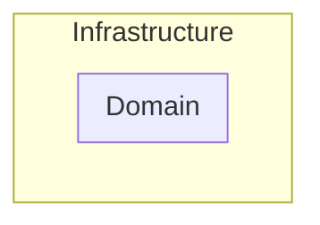

# Clean Architecture

### Domain
- `Business Rules`가 존재하는 영역
- 잘 변하지 않는 안정된 영역

### Infrastructure
- `UI`, `Database`, `Web APIs`, `Frameworks`등이 존재하는 영역
- `Domain`에 비하여 자주, 쉽게 바뀌는 영역

## Dependency Rule

> 모든 소스코드 의존성은 반드시 `outer`에서 `inner`로, 고수준 정책을 향해야 한다.

- `Dependency Rule`은 비즈니스 로직을 담당하는 코드들이 DB, Web같이 구체적인 세부사항에 의존하지 않고 독립적으로 실행되어야 한다는 규칙
- `Domain`은 `infrastructure`에 대해서 아무것도 모름
- 
