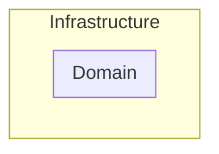

---
title: Layered Architecture
date: 2023-01-25 18:50:00 +09:00
categories: [Blog, Architecture, DDD]
tags: [architecture java ddd]
---

# Clean Architecture

### Domain
- `Business Rules`가 존재하는 영역
- 잘 변하지 않는 안정된 영역

### Infrastructure
- `UI`, `Database`, `Web APIs`, `Frameworks`등이 존재하는 영역
- `Domain`에 비하여 자주, 쉽게 바뀌는 영역

## Dependency Rule

> 모든 소스코드 의존성은 반드시 `outer`에서 `inner`로, 고수준 정책을 향해야 한다.

- `Dependency Rule`은 비즈니스 로직을 담당하는 코드들이 DB, Web같이 구체적인 세부사항에 의존하지 않고 독립적으로 실행되어야 한다는 규칙
- `Domain`은 `infrastructure`에 대해서 아무것도 모름

### Entities
- 애플리케이션에서 핵심적인 기능인 `Business Rule`들을 담고 있음
- 핵심 업무 규칙을 캡슐화
- 가장 변하지 않으며 외부로부터 영향을 받지 않음

### Use Cases
- 시스템이 어떻게 자동화 될 것인지에 대해서 정의하고 애플리케이션의 행위를 결정
- `Entities`에 의존하는 동시에 상호작용
- `outer layer`에 대해서는 아는 것도 없고 관심도 없음

### Adapters
- `Domain`과 `Infrastructure`사이의 번역기 역할
- GUI의 MVC아키텍처를 완전히 내포하며, `Presnter`, `View`, `Controller`가 모두 여기에 속함

### Infrastructure
- 모든 `I/O components (UI, DB, frameworks, devices)`가 있는 곳
- 변화될 가능성이 매우 높기 때문에 안정적인 `Domain`과는 확실히 분리 되어 있고, 비교적 쉽게 변화되기 때문에 다른 `components`과 쉽게 교환됨

